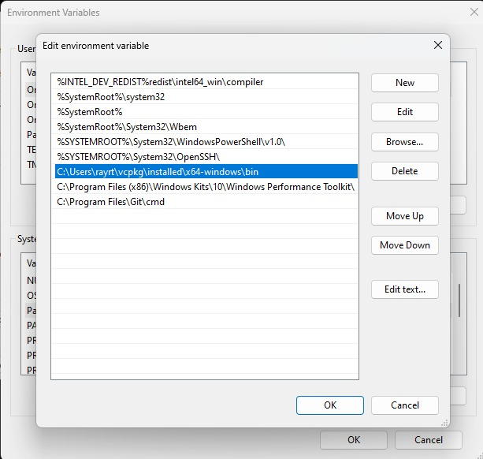

# Bookstore Inventory BTree Solution 

Native CRUD project for a bookstore inventory developed in C++ using BTree as data structure and JSONCPP Library to parse the Json readed from a CSV file.

## Usage

1. **Upload Books**: Reads book data from `input.csv` and inserts it into the B-Tree, deletes, and updates books.
2. **Execute Searches**: Reads search queries from `search.csv`, performs the searches, and writes the results to `output.txt`.


## Run Locally (Windows Powershell)

**!important**: Recommended IDE: Visual Studio. 

[](https://skillicons.dev)

#### 1. Clone the project

```bash
  git clone https://github.com/hayyrs66/bookstore-inventory
```

#### 2. Open Visual Studio

#### 3. Open a project or solution
#### 4. Open books.sln

Now you need to set up vcpkg to install jsoncpp.

#### 5. Clone the vcpkg project
```bash
  git clone https://github.com/microsoft/vcpkg.git
```

#### 6. Run a script to build vcpkg

```bash 
  cd vcpkg; .\bootstrap-vcpkg.bat
```
Or run the script from the file explorer.

#### 7. In the same directory (vcpkg) run
```bash 
  vcpkg install fmt
```
```bash
  vcpkg integrate install
```
Go and copy the path of vcpkg\installed\x64-windows\bin

**Example :**
 C:\Users\rayrt\vcpkg\installed\x64-windows\bin

Go to the system environment variables
Go an edit the `Path` variable

Click on `New` and paste the path you copied before.




#### 8. In the directory of vcpkg run
```bash
  vcpkg install jsoncpp
```

Create a new project of C++ and go to the properties of your project

In `Configuration Properties` go to vcpkg settings and be sure that `Use Vcpkg` and `Install Vcpkg Dependencies` are set to `Yes`

You are setted up.

# Explanation

The structure of the project is as follows.

### File Structure

- **books.cpp**: The main entry point of the application. Initializes the testing environment and executes the main functionalities.
- **Testing.h / Testing.cpp**: Handles the testing of the B-Tree implementation, including uploading books and executing searches.
- **BTree.h / BTree.cpp / BTreeNode.h**: Implements the B-Tree data structure used for storing and managing book data.
- **Book.h**: Represents individual book entities with attributes like title, author, and ISBN.
- **Inventary.h**: Manages the collection of books using the B-Tree, providing methods for adding and searching books.
The data structure is a standard B-tree of degree 3.

Currently using a degree 3 because a lower degree B-tree uses less memory per node. For a small dataset like 100 books in this case, the memory overhead of additional pointers in each node is minimal.

The BTreeNode class has BTree as a friend class since these two classes are closely related. This simplifies the design, allowing BTree to directly access BTreeNode.
## Features

- **Efficient Data Storage**: Utilizes a B-Tree with a degree of 3 to store book data, ensuring balanced and efficient data management.
- **CSV Integration**: Supports uploading book data from a CSV file and executing search queries from another CSV file.
- **Search Functionality**: Provides fast search capabilities to find books based on name.
- **Output Results**: Outputs search results to a text file for easy review.
- **Modular Design**: The code is organized into distinct classes and files, each with a specific responsibility, enhancing readability and maintainability.


